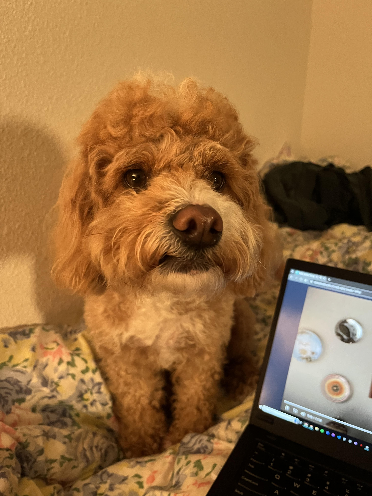
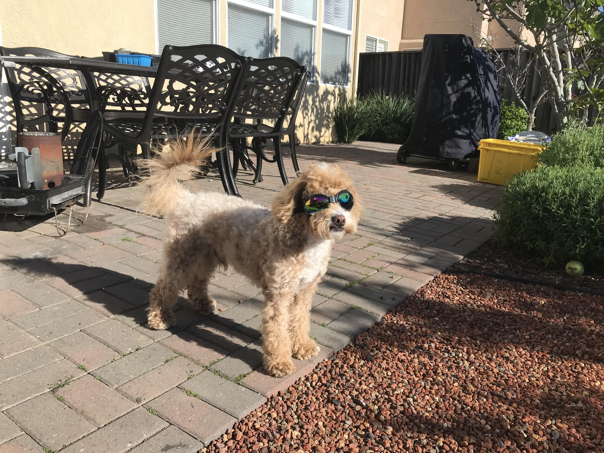

# Jessica's User Page
### About Me

I'm a second year studying Math-CS and I aspire to be a software engineer in the future. Some other things I do are badminton in the school club and hosting dinner parties. 

My favorite things to cook are:
- eggs
- soft tofu stew
- tiramisu

_if you are also an avid cook and like eating good food together let's host a dinner party_

I also have a dog that I really love.

[my doge](dog2.jpg)

[my doge2](dog1.jpg)

If I were to get another dog, I would want a:
1. Golden Retreiver
2. Berner
2. Husky

One quote that I hold dear is 
> "work hard play hard"
because I like being able to separate the two and living a good life while doing my best with work.

Some restaurants I want to visit are:
- [ ] 10 Butchers
- [ ] Yukdaejang
- [x] Yintang

If you're interested in being friends, gym buddies, or foodie explorers, my instagram is [qu__jessica](https://www.instagram.com/qu__jessica/)

## My Programming Life

As a programmer, I'm looking for internships for the quarter as well as for summer, but I'm currently a software engineer for Robosub and taking on an academic internship at a startup on campus. Something I was proud of myself for doing today while completing this lab was being able to edit the README file with vim, using `vim README.md`, which I hadn't touched since 15L. 

Go back to [About Me](#About-Me)
